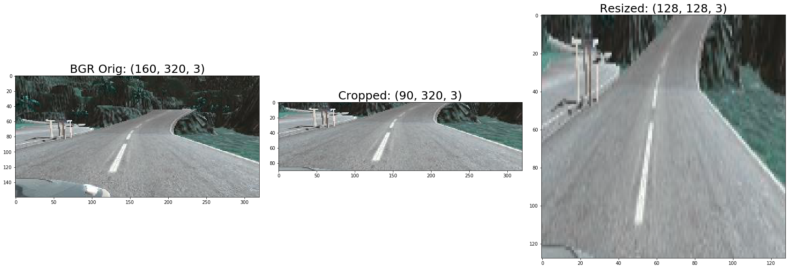
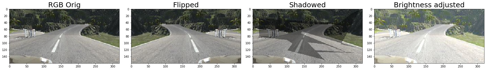
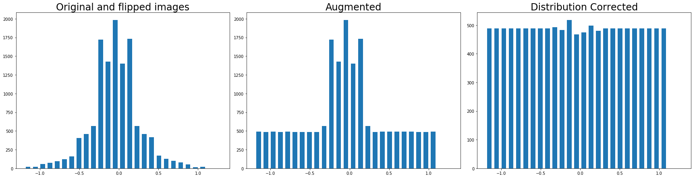

# Behavioral Cloning
Chris Sharp

### Overview
---

In this project I train a Keras model to provide steering data to a car in a driving simulator.  The [provided simulator](https://github.com/udacity/self-driving-car-sim) was used to gather training data from the 2 included tracks.  Images were converted to BGR, cropped, resized, and the data set distribution was balanced before input to the neural network. The resulting model could then be used to steer the car autonomously down the road using the simulator's 'Autonomous Mode'

The main files in this project are:
* `model.py` - Script used to train the model
* `model_definition.py` - Model definition script
* `data.py` - Utilities used to read data, preprocess data, augment data, etc.
* `drive.py` - Script to drive the car
* `model.h5` - The trained Keras model
* `video1.mp4` - A video recording of the vehicle driving around the basic track
* `video2.mp4` - A video recording of the vehicle driving around the mountain track


### Collecting Data
---

Data collection was done using the simulator in 'Training Mode.'  After much trial and error I found that it was not necessary to gather images from a full lap around each track. For the first track I drove just past the bridge to the first dirt patch and for the mountain track I drove only half-way around.  Successfully driving autonomously around the entire track while only training on a portion of it was an indication to me that the model generalized to all track conditions and did not overfit the training data.  In the end I gathered over 3500 images from each track for a total data set size of 7650 images.

### Preprocessing Images
---

Images were preprocessed before feeding to the neural network. I tried different color spaces and found that the model generalized best using images in the BGR color space. Training with the YUV color space gave erratic steering corrections resulting in too much side-to-side movement of the car.  In the RGB color space some areas of track 1 required many more training images to navigate correctly, particularly the areas with dirt patches on the side of the road.  Conversion to BGR solved both of these issues and required less training files overall.  After conversion to BGR, I crop the unnecessary portions of the image (background of sky, trees, mountains, hood of car) taking 50 pixels off the top of the image and 20 pixels off the bottom.  The cropped image is then resized to (128, 128) for input into the model.  I found that resizing the images decreased training time with no effect on accuracy.



### Data Augmentation
---

I tried several methods of data augmentation.  Images could be augmented by flipping horizontally, blurring, changing the overall brightness, or applying shadows to a portion of the image.  In the end, adding horizontally flipped images was the only augmentation that was necessary.  Randomly changing the images to augment the data set was not only was not necessary but when using the RGB color space I saw a loss of accuracy.  By adding a flipped image for every original image the data set size was effectively doubled. See the functions `random_blur()`, `random_brightness()`, and `random_shadow()` in the file `data.py` for augmentation code. Visualization of data augmentation can be found in the Jupyter notebooks `Random_Brightness.ipynb` and `Random_Shadow.ipynb`.



### Data Set Distribution
---

One improvement that was found to be particularly effective was to fix the poor distribution of the data.  A disproportionate number of steering angles in the data set are at or near zero.  To correct this steering angles are separated into 25 bins. Bins with a count less than the mean are augmented while bins with counts greater than the mean are randomly pruned to bring their counts down. This equalizes the distribution of steering angles across all bins.  Code can be found in the function `fix_distribution()` in `data.py.`  Plotting can be seen in the jupyter notebook `Fix_Distribution.ipynb`



### Model
---

The empirical process of finding the correct neural network can be a lesson in frustration.  I started with LeNet [1] and tried countless modifications.  Feeling the need for something slightly more powerful to increase nonlinearity and work for both tracks I moved on to a modified NVIDIA architecture[2].  Image data is preprocessed as described above before being normalized in the first layer.  The network consists of 5 Convolutional layers with max pooling and 5 fully connected layers.  Dropout layers were used in between the fully connected layers to reduce overfitting.  An Adam optimizer was used with a learning rate of 1e-4. Code for the model can be found in `model_definition.py`

The final network is as follows:

| Layer                   | Output Shape  | Param # |
|:-----------------------:|:-------------:|--------:|
| Normalization (Lambda)  | (128, 128, 3) |       0 |
| 1st Convolutional/ReLU  | (124, 124, 24)|    1824 |
| Max Pooling             | (62, 62, 24)  |       0 |
| 2nd Convolutional/ReLU  | (58, 58, 36)  |   21636 |
| Max Pooling             | (29, 29, 36)  |       0 |
| 3rd Convolutional/ReLU  | (25, 25, 48)  |   43248 |
| Max Pooling             | (12, 12, 48)  |       0 |
| 4th Convolutional/ReLU  | (10, 10, 64)  |   27712 |
| 5th Convolutional/ReLU  | (8, 8, 64)    |   36928 |
| Flatten                 | (4096)        |       0 |
| Dropout                 | (4096)        |       0 |
| 1st Fully Connected     | (1164)        | 4768908 |
| Dropout                 | (1164)        |       0 |
| 2nd Fully Connected     | (100)         |  116500 |
| 3rd Fully Connected     | (50)          |    5050 |
| 4th Fully Connected     | (10)          |     510 |
| 5th Fully Connected     | (1)           |      11 |

### Training
---

Training the network is done using the python script `model.py`.  By default the script runs for 10 epochs although the script will take a different number of epochs as a parameter.  The script by default allocates 80% of the data set to training and 20% to validation sets.

```
python model.py 20  # train for 20 epochs.
```

The script reads the image data from the CSV file, performs any augmentation and distribution balancing, and starts training on the data set.  Due to the possibility that the entire collection of image files might not fit into memory all at once the data set is separated into batches by a Keras generator.  The generator creates batches of `BATCH_SIZE` images, reading image data and augmenting the images on the fly. See the function `get_generator()`, line 383, of the file `data.py` for generator code.  Generators were used for both training and validation sets.

### References
---
<a id='ref_1'></a>[1] Y. LeCun, L. Bottou, Y. Bengio, and P. Haffner. [Gradient-Based Learning Applied to Document Recognition](http://yann.lecun.com/exdb/publis/pdf/lecun-01a.pdf)

<a id='ref_2'></a>[2] M. Bojarski, D. Testa, D. Dworakowski, B. Firner, B. Flepp, P. Goyal, L. Jackel, M. Monfort, U. Muller, J. Zhang, X. Zhang, J. Zhao, and K. Zieba.  [End to End Learning for Self-Driving Cars](https://images.nvidia.com/content/tegra/automotive/images/2016/solutions/pdf/end-to-end-dl-using-px.pdf)